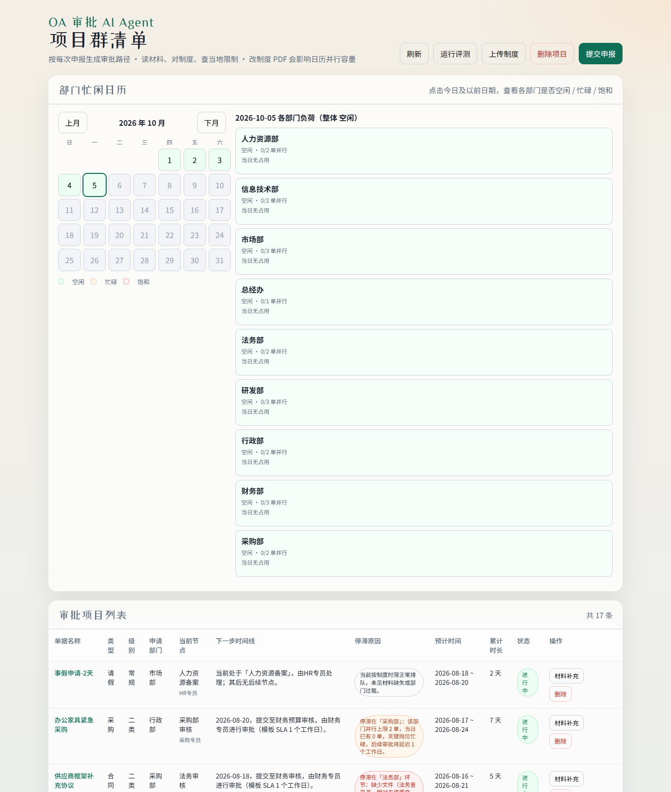
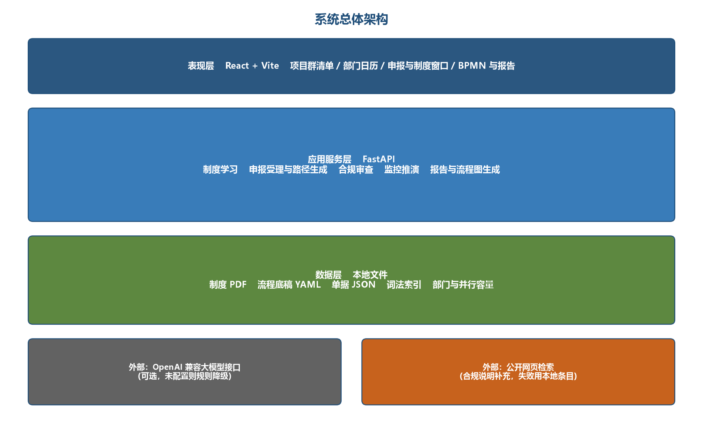
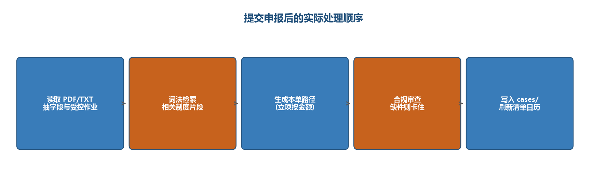

# OA Approval AI Agent

Learns an approval path from company policy PDFs, then builds a project portfolio, a department calendar, an SLA timeline, a BPMN diagram, and a written report for each application. The next step and its due date come from a deterministic engine. The language model reads the policy, extracts fields, and writes the explanation. The portfolio and the timeline still run when no API key is set.

Internship project at the Institute of Automation, Chinese Academy of Sciences. The interface is React and Vite. The service is FastAPI.



---

# OA 审批 AI Agent

从制度 PDF 学习审批路径，为每一笔申报生成项目清单、部门日历、SLA 时间线、BPMN 流程图和分析报告。下一节点和时间由确定性引擎计算；大模型负责读制度、抽取字段和写说明。没有配置密钥时，清单和推演仍可运行。



## 项目要点

- **制度学习**：上传 PDF 后抽取流程节点、部门并行容量，合并进 YAML 流程模板
- **按单生成路径**：立项、报销、采购、合同、请假走不同模板；金额和材料决定分支
- **合规闸门**：缺件会停在当前节点，并说明卡点，而不是直接放行
- **部门日历**：用各部门并行处理上限安排后续节点，改制度会改变日历容量
- **可核对**：金标准评测检查「当前节点 + 金额 → 下一节点」；前端可一键跑评测
- **可降级**：LLM 使用 OpenAI 兼容接口（DeepSeek / Qwen）。未配置密钥时，抽取和报告走本地规则

## 提交一笔申报之后



表现层是 React + Vite：项目群清单、部门日历、申报窗口、BPMN 与报告。应用层是 FastAPI：制度学习、路径生成、合规审查、监控推演。数据落在本地 PDF、YAML 模板和 JSON 单据上，词法检索制度片段，不依赖向量数据库。

## 技术栈

| 层 | 选择 |
| --- | --- |
| 前端 | React 19、TypeScript、Vite、bpmn-js |
| 后端 | Python、FastAPI、Pydantic |
| 流程 | YAML 模板 + 确定性 SLA / 下一节点引擎 |
| 制度 | PyMuPDF 解析 PDF，词法索引检索相关条款 |
| 模型 | OpenAI 兼容接口，可选；默认可接 Qwen / DeepSeek |

## 本地运行

后端：

```bash
cd backend
python -m venv .venv
.\.venv\Scripts\activate
pip install -r requirements.txt
copy .env.example .env
python -m app.scripts.seed_demo
uvicorn app.main:app --reload --port 8000
```

前端：

```bash
cd frontend
npm install
npm run dev
```

打开 http://localhost:5173 。接口文档在 http://localhost:8000/docs 。

`.env` 里填写 `LLM_API_KEY`、`LLM_BASE_URL`、`LLM_MODEL`。示例见 `backend/.env.example`。

把制度 PDF 放到 `data/policies/` 后，在页面点击「上传制度」。仓库里的 `data/templates/` 已包含报销、采购、合同、请假四类流程底稿，`data/samples/` 是可直接提交的演示申报材料。

## 目录

```text
backend/app    FastAPI、制度学习、推演引擎、BPMN 与报告
frontend/      项目群清单界面
data/templates 四类流程 YAML
data/samples   演示申报材料
data/eval      下一节点金标准
docs/figures   架构图
```
